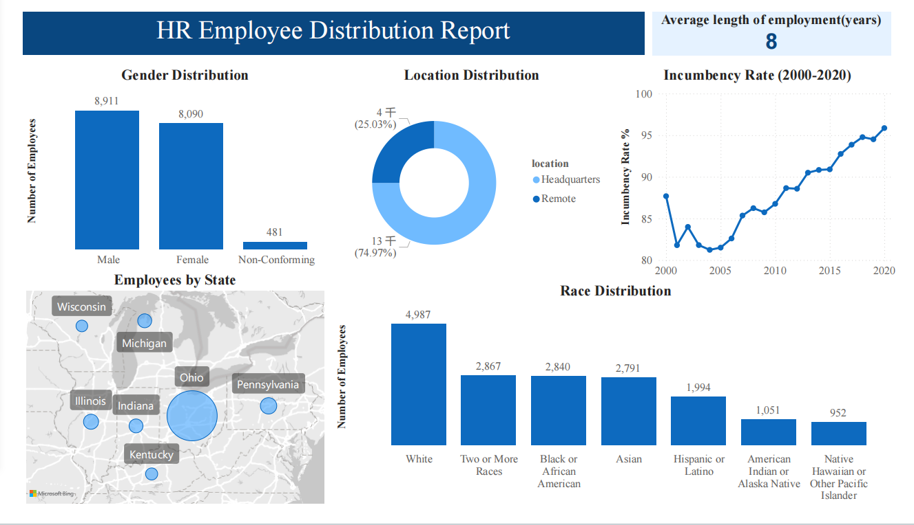

# HR-Project

## Data Used
HR Data with over 22000 rows from the year 2000 to 2020.
## Data Cleaning and Analysis
Use MySQL Workbench to clean and analyze data.
### Data Cleaning
- Change column name
- Modify column data type
- Update table by CASE WHEN function
### Data Analysis
- WHERE clause, GROUP BY,ORDER BY
- Aggregate functions such as SUM(),AVG(),COUNT()
- CASE WHEN function
- Derivative table
- Subquery
## Data Visualization
Use Power BI to create dashboard.

